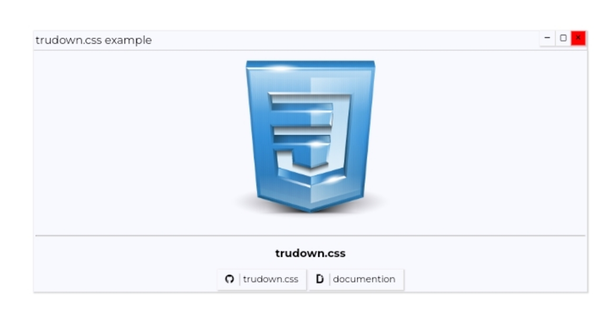

# Trudown.css v1.0.0

##### Trudown.css is like business tools software Design
you want test link :- [dev mode[ building ]](http://htmlpreview.github.io/?https://github.com/Muhammed-radin/trudown.css/blob/master/tester.html)

## screenshots :-
 
 

# installation 
   
 - please download first **[trudown.css](trudown.css)** and **[trudown.js](trudown.js)**
 - import your project or folder add trudown.css and js file
 - add your html link-code 
   ```html
   <!-- trudown.css import-->
   
   <link rel="stylesheet" href="trudown.css">
   
   <!-- fontawesome cdn-->
   
   <link rel="stylesheet" href="https://cdnjs.cloudflare.com/ajax/libs/font-awesome/6.0.0-beta3/css/all.min.css" integrity="sha512-Fo3rlrZj/k7ujTnHg4CGR2D7kSs0v4LLanw2qksYuRlEzO+tcaEPQogQ0KaoGN26/zrn20ImR1DfuLWnOo7aBA==" crossorigin="anonymous" referrerpolicy="no-referrer" />
   ```
  or import with css 
  ```css
  @import trudown.css;
  ```
 - add scripts on html
   ```html
   <!-- trudown.js -->
   
   <script src="trudown.js"></script>
   
   <!-- jquery (required) -->
   
     <script src="https://cdnjs.cloudflare.com/ajax/libs/jquery/3.6.0/jquery.js" integrity="sha512-n/4gHW3atM3QqRcbCn6ewmpxcLAHGaDjpEBu4xZd47N0W2oQ+6q7oc3PXstrJYXcbNU1OHdQ1T7pAP+gi5Yu8g==" crossorigin="anonymous" referrerpolicy="no-referrer"></script>

   ```
 - test the trudown.css 
 
 ### how to check trudown.css 
 
 add your html button tag or button class in a element
 - example 
   ```html
   <button> example </button>
   ```
 if not working this please report on **[github issues](https://github.com/Muhammed-radin/trudown.css/issues)**

 more documentation coming soon 